# An Overview of Dialogue Systems in Games
Consuming narrative in games often requires some form of system by which the player (us) listens to, or reads, the dialogue between characters. In this post, we will discuss text-based dialogue systems as seen in games like <i>Fallout 4</i>, <i>The Witcher 3: Wild Hunt</i>, and others. These dialogue system will vary in both functionality and display which provide their own features for their game. This post seeks to understand the decisions, along with any necessary implementation details, made by developers when designing their dialogue system in order to pave a direction for when I implement a working system of my own. As such, I will discuss multiple topics relevant to dialogue systems down below. 

## Basic Design 
Although dialogue systems in games can vary widely depending on the needs of the game, many aspects will remain the same. 

These commonalities include:
```
1. A way to display the text onto the screen (UI)
2. The need to store the text somewhere
3. Reading through the dialogue continues story progresion
```

However, there are many features that are present in some games but not others. These features are made to enhance the current game's experience, but may not necessarily be relevant or necessary if present in another game.

These optional features include:
```
1. Player Choice in Dialogue
2. Skip Feature
3. Log (being able to see a log of what was said so far in the current conversation)
```

These decisions will be visited in the later discussion but should lay down a foundation for what one can expect from the dialogue systems discussed. 

## Player Choice - ໒(⊙ᴗ⊙)७✎▤
An important aspect in many narrative-heavy games is allowing the player to decide the choices made by the protagonist whether it be which quest to take next or how you speak to another character. Take the Witcher 3's decision tree for instance.
<br/><br/>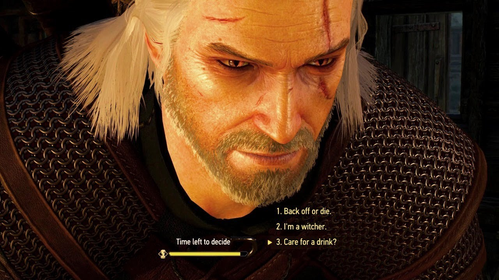<br/>
Or Fallout New Vegas's decision tree:
<br/><br/>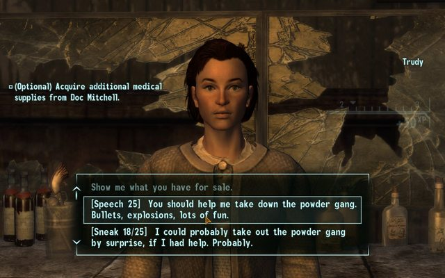<br/>
<br/>
Both are examples of how, in a RPG game where the player is encouraged to experience varying playstyles, having dialogue choices that can affect the story is a vital part of creating the experience CD Projekt Red and Bethesda envisioned. 

This feature can be further explored in games like Fallout New Vegas where making choices may require the player to pass a stat check, such as <b>Speech</b>. As shown above, the player may only choose that option if they leveled up their Speech stat enough. In RPG games like the Fallout series, it is very relevant to the game mechanics that this be a feature that is included in the dialogue system. However, other games like The Legend of Zelda: Twilight Princess, may not have conditional choices like this. 

A player-choice implementation can be roughly sketched as follows:
```
1. Have a data structure that tracks the varying branches of dialogue where each branch is the product of the player having made a decision
2. Prompt the player with a series of options mid-dialogue. This prompt should pause the rest progression of the rest of the dialogue until the player has clicked their choice. Alternatively, have a timer (as seen in the Witcher 3 image above) where the dialogue will continue down a particular path even if the player has yet to make their choice
3. Include a condition check, which would require reading the player's stat to determine if a particular choice is available for choosing by the player 
4. Remember which choices were made (possibly have flag variables) if the choices are vital in determining the ending of the game
```

## How Text is Stored - (づ ◕‿◕ )づ
Yes this is very obvious (of course the text in a dialogue system has to be stored somewhere (－_－) zzZ), but this is actually quite interesting to think about. When typically writing a script for character dialogue, should the writer just use Microsoft Word or Google Docs to do this and then retype it all into the game? Or should the text on the screen just read it from a text file stored in some folder? It very much depends on the scope of the game and how much dialogue there is (sorry for the boring answer). One method for writing this dialogue is with <a href="https://store.steampowered.com/app/1273620/Dialogue_Designer/">Dialogue Designer</a>that looks like this:

<br/><br/>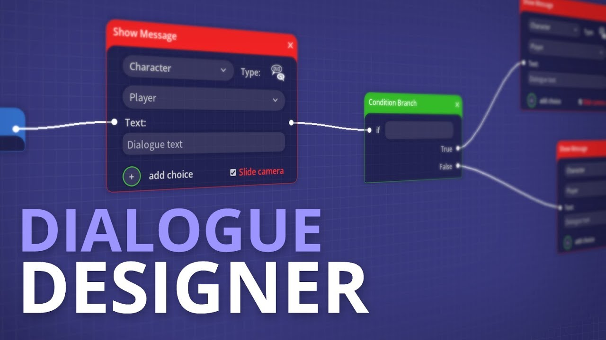<br/>
<br/>

It seeks to handle the whole dialogue system's internal logic, including storing and maintaining the branching dialogue paths as explained previously. However, as shown in the picture, the developer must manually enter the whole script into this data structure, which may be impractical or inefficient. For small projects, it can be a quick solution, but for larger projects with thousands of pages of dialogue, there may be a better solution. 

Given the variance in project size and requirements, how the actual text in dialogue is stored can vary. It could be a regular text file, XML, or some variation or database. So long as the information can be parsed, its implementation should not be a huge concern. However, one important thing to note is that a text file, for example, can be easily accessed and read by anyone who ventures into the game's directory. One solution to this is to encrypt the files so that someone cannot spoil the ending of the game for themselves.  

## Other Features ٩(•̤̀ᵕ•̤́๑)ᵒᵏᵎᵎᵎᵎ
Features like skipping the current conversation or opening a log of the current conversation are quality of life features that, while not necessary, can enhance the experience for some players. We will look at Arknights' implementation of these features as shown below:

First is the <b>skip</b> feature as seen in the top-right of the screen: 
<br/><br/>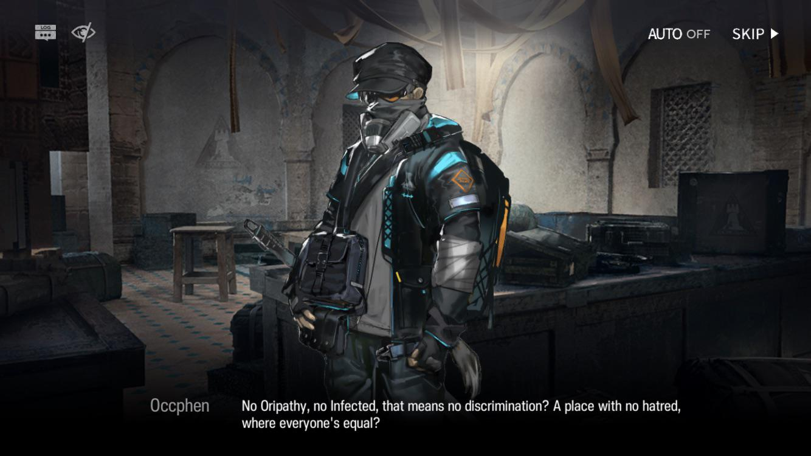<br/>
Although it is counter-intuitive for a narrative-based game to allow players to skip the narrative, it is nonetheless a nice feature to have if player wishes, for any reason, to skip this current section of the story. For a game like Arknights where the stories are lengthy and regularly has time-limited story events, players may wish to speed through the story to obtain the rewards at the end. In this case, it does make sense why a skip feature may be sensible.

Second, the <b>log</b> feature is a useful tool that lets players read through the previously spoken dialogue(I am sure we have all read a page in a book and then later realized we didn't comprehend anything). Below is a demonstration of this feature in action. 
<br/><br/>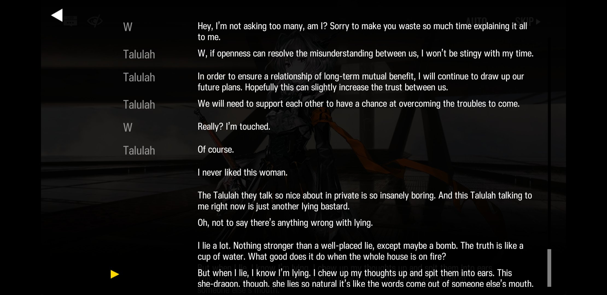<br/>
<br/>
I find this feature very handy but seldom see it in high-production games like those of Bethesda. I moreso only see it in visual novels where the dialogue system is its raison d'etre. This does make sense, since highly narrative-based visual novels would devote functionality into its dialogue-related features. 

The implementation of the log system is quite simple. All it requires is a series of key-value pairs that associate the character with their dialogue. This can be further developed by including a button next to each dialogue line that restarts the audio file of that character's line.

The implementation of the skip feature is a little more complicated since it depends more on how you implemented the dialogue system. You would have to create the logic of the dialogue system in such a way that allows whole sequences of dialogue to be skipped while preserving the current path in the story. Complications may include
```
1. If letters are displayed onto the screen one-at-a-time, like 
```
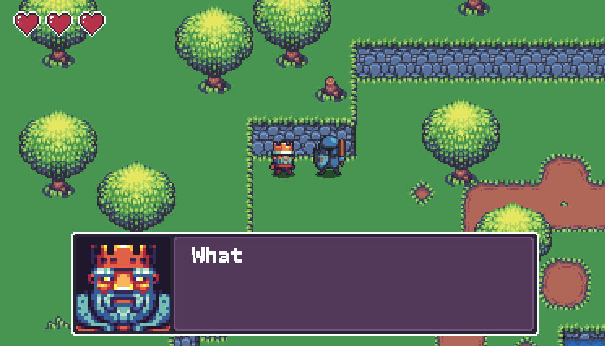<br/>

```
then you must make sure that the animation effect does not conflict with the skip feature.

2. If there are player choices in the dialogue, the skip feature should only until the next player choice appears if present, or skip until the end if not
```

## User Interface - (っ˘ڡ˘ς)
(The most interesting topic of this post!) The way that the dialogue system looks is by far the biggest immediate differentiator between them. The UI will vary depending on the genre of game, and can take on different styles. 

We will first examine the difference between standard 3D games' dialogue system and those of visual novels. 

### In Standard Games
<div style="margin-left:20px">

In standard games, what is typically seen is a more bare-bones dialogue system. One that only shows what is said, like Mass Effect's:
<br>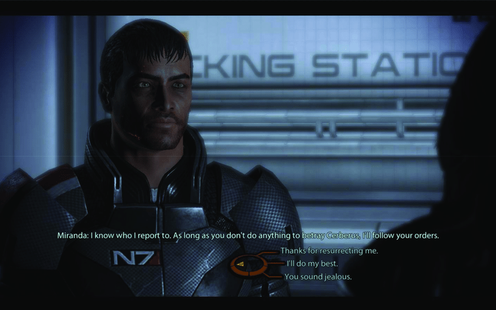
<br/>

The games that I'll be talking about will mostly pertain to 3D games since they are the most relevant to this section and offer the widest variation. What also makes 3D games interesting is the duality between 2D and 3D spaces. As seen above, the Mass Effect is a 3 dimensional game that has a 2D UI, meaning that the dialogue system is statically displayed onto screen space. 

<p style="float:left; width:50%">
In contrast, We Should Talk uses its 3D world to the fullest where its characters operate in 3D world space along with the UI. As seen to the right, the dialogue boxes appear in world space rather than screen space, showing a differentation between it and other games through the UI space. In doing so, the dialogue boxes feels more dynamic since they look and act as if they exist in the game's world rather than just on the user's screen. 
</p>
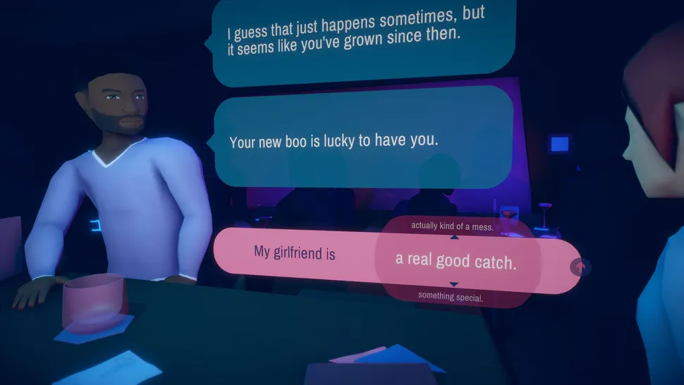

<br style = "clear:both">

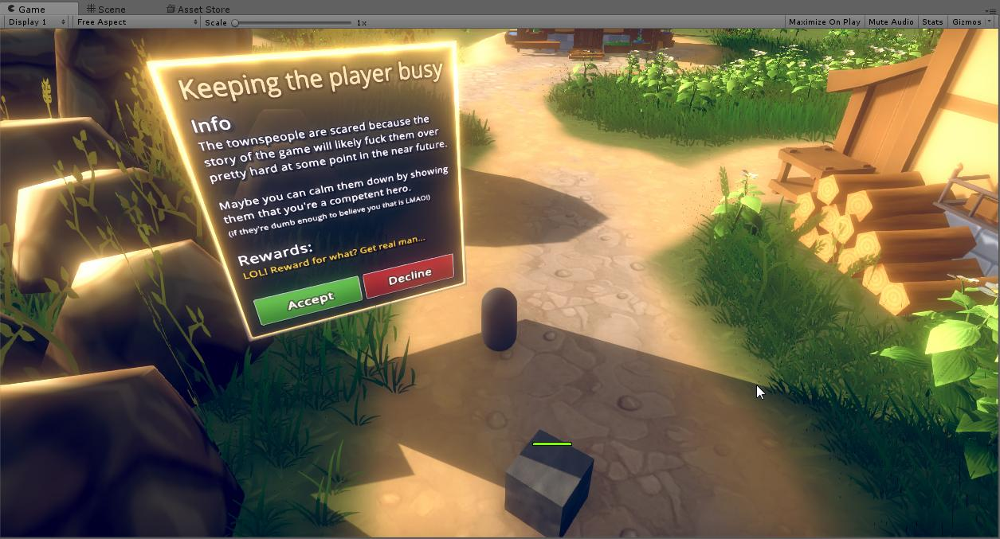
<p style="float:left; width:50%">
There exists a specific setting in the Unity engine that enables this and allows UI elements (like those shown to the right) to exist in world space. Although it can make the display more dynamic, it is ultimately a stylistic choice that developers must make (and typically do not take) when determining what kind of aesthetic they want. Some may want the standard screen-space UI, but others may want to try this different style. 
</p> 


</div>

<br><br>
___________________________________

### In Visual Novel Games
<div style="margin-left:20px">
In visual novel games like Phoenix Wright, the dialogue text is often accompanied by the name of the character, and in the case of the Arknight's picture <a href="#ak1">we saw previously</a>, a .jpg of the character as well.

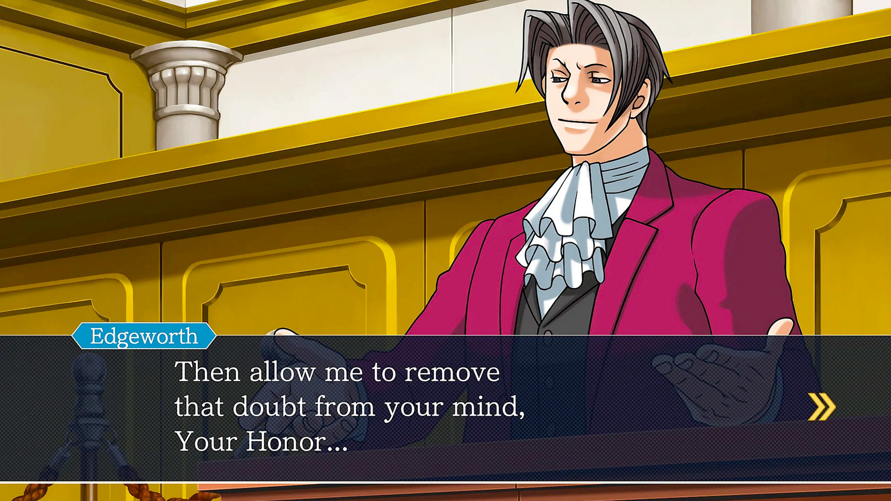<br style="clear:both;"/>

It is my personal opinion that the typical visual novel style is rather boring to look at. This can be somewhat mitigated by having an interesting style, such as Persona 5's very stylized aesthetic:
<br>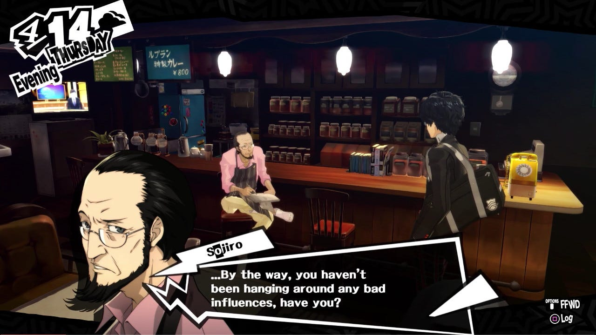<br/>

The shapes used for the dialogue box along with the layering of the 2D images over the 3D gives it a level of depth that makes it much more interesting to look at, which is one way to give this visual novel style more appeal. As we will discuss later, there are many other aesthetics that are used in visual novels to accomplish this.
</div>

<br><br>
___________________________________

### In Visual Novels

<div style="margin-left:20px">
One final style of UI that we will discuss is the full-fledged visual novel style seen in many of Kinoko Nasu's works, which is the type of dialogue system UI that I would like to make. It's UI is demonstrated below (taken from Witch on the Holy Night).

<br>


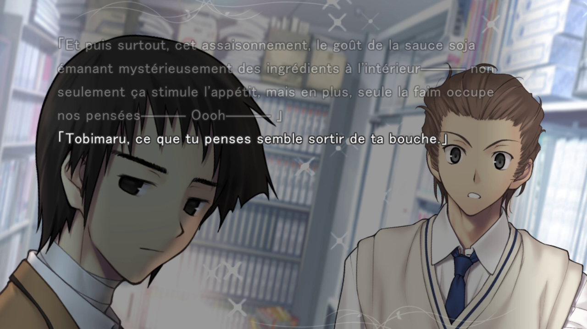

To explain its minimalist UI, whenever a character speaks, there will be a darkened column/region in the middle of the screen with words loading onto it. When no words are spoken, this region will disappear so the user can just look at the images on their screen unimpeded. 

The text covers nearly the entire screen which contrasts heavily with other examples we've seen. 


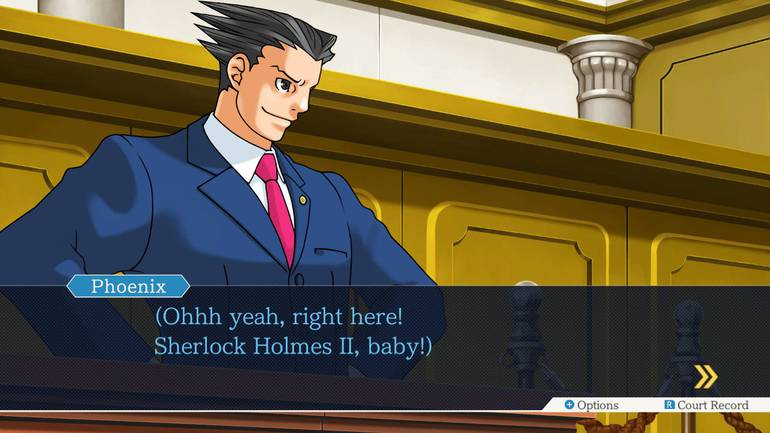

In these 2 examples, we have what I call a **full screen dialogue box** and a **partial screen dialogue box**

### Full Screen Dialogue Box
<div style="margin-left:20px">

This difference is the reason why I much prefer this style over all others for this type of media (visual novel). It gives a larger emphasis on the narrative text, since the text is at the forefront of what the players see. It essentially has the whole screen as the dialogue box which, visually, gives greater importance to the words spoken by the characters.

Its implementation does not have to keep track of character names nor does it need multiple regions to display text as seen in the Phoenix Wright image. Rather, it only requires a way to display a single block of text, albeit with some functionality such as:

```
1. Between each spoken line of a character, the player must be able to press 'space' to continue to the next line
2. Previous text should be slightly dimmed as the current line is loaded onto the screen with standard brightness
3. There is typically a button that can be pressed to toggle the dialogue system on and off (as a way to let players see the background image more clearly)
```

Also, since the text displayed is mostly just big blocks of text rather than smaller, cut up blocks of text like from Phoenix Wright, there would be fewer individual objects required to create in the game engine. As seen in the Dialogue Designer software previously, this can be a tedious process that should be mitigated if possible. 
```
[ ====== LARGE BLOCK OF TEXT ====== ] --> [ ======= LARGE BLOCK OF TEXT ======= ] 

vs

[SMALL BLOCK] -> [SMALL BLOCK] -> [SMALL BLOCK] -> [SMALL BLOCK] -> [SMALL BLOCK] 

```


</div>

### Partial Screen Dialogue Box
<div style="margin-left:20px">

Although the standard and effective approach in many games' dialogue systems, it visually looks boring.
It may also require a more complicated data structure(s) when implementing the system given you may need an object for each piece of dialogue in a scene. It also puts a large emphasis on the images on the screen rather than the narrative text, and in many visual novels, these images are static, non-moving, and boring (!)

```
                            ╱|__
                          (˚ˎ 。7  
                           |、˜〵          
    (boredoom)             じしˍ,)ノ
 
```
However, it would be much easier to sync together the dialogue line with a voice file and character image, since each dialogue box would sync with 1 character at a time. In the case of Phoenix Wright, it is a simple enough game that where a system like this accomplishes everything it needs to do. Especially since there is an emphasis on different sides clashing with each other (defendant vs prosecution), the more distinct differentiation between the characters does a great job. 


</div>

</div>

<br><br>

## Takeaway

Since I would like to implement a Full Screen Dialogue System, here is the outline on what it would involve (since I don't have enough time to do this right now (Fall 2023 semester) :D )

1. A screen-full of text will constitute 1 Dialogue_Box object
   1.  Each Dialogue_Box object will point to another Dialogue_Box object when the 1st ends
   2.  Each Dialogue_Box object will include a Dialogue_Text Object and a Dialogue_Animations Object
   3.  The animations will be in sync with the text, where each animation pertains to the images on the screen (such as a character sprite moving around in between or during a dialogue line)
       1. To get in sync, if there are 7 dialogue lines in the current object, then each animation will have an [int start_animation] variable that will start the animation at the given dialogue line
       2. If the player prematurely starts the next dialogue line while the current line is still be spoken/animated, the current animation should be skipped to its end result 
2. ...